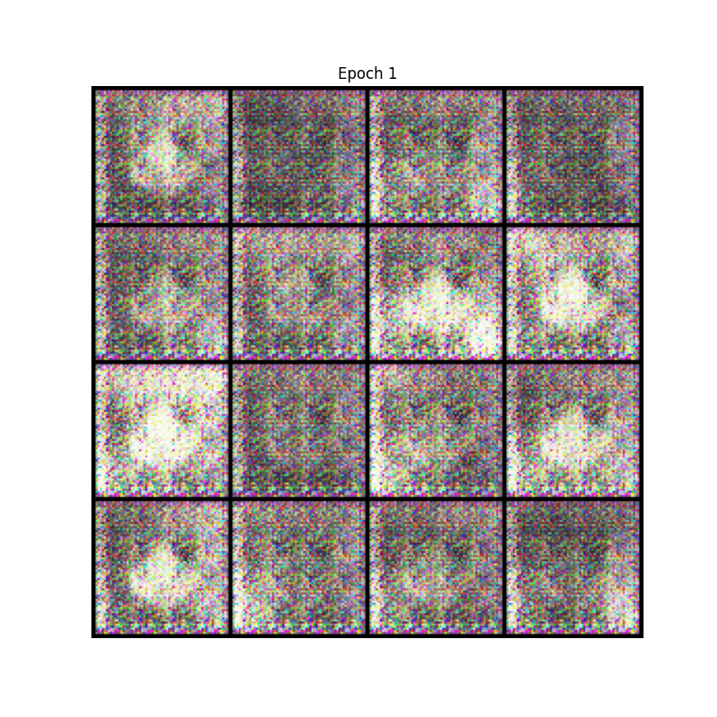
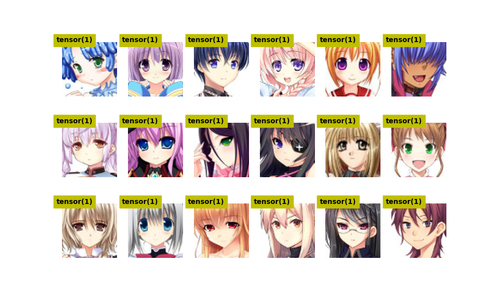
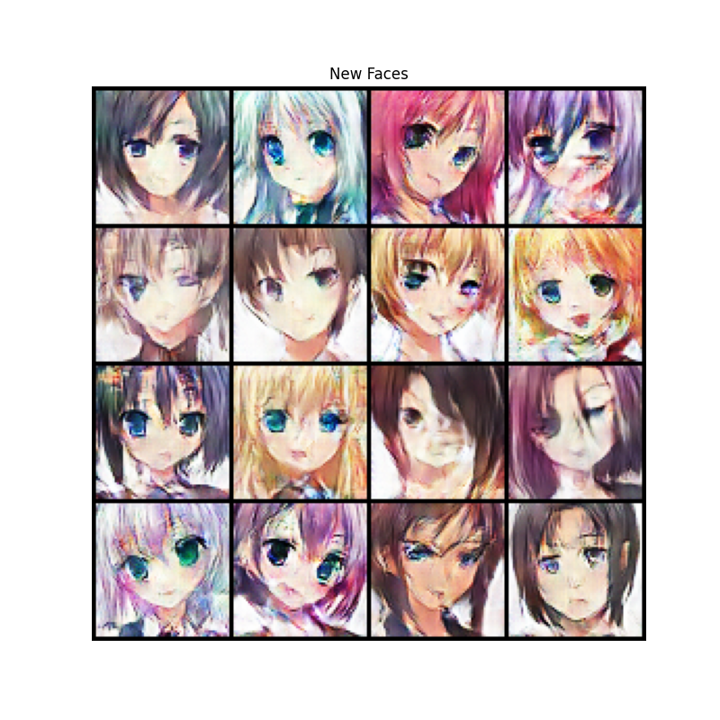
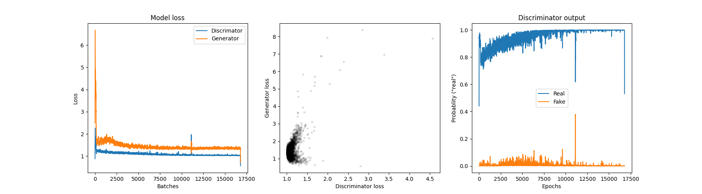

# Anime Face Generation with DCGAN

This repository contains a PyTorch implementation of a Deep Convolutional Generative Adversarial Network (DCGAN) designed to synthesize anime-style faces. The model is trained on a dataset of anime characters to learn the underlying distribution of artistic features and generate new, unique images.

## Project Overview
The project utilizes a Generator and a Discriminator in a zero-sum game:
- **The Generator** learns to create realistic images from random noise.
- **The Discriminator** learns to distinguish between real images from the dataset and synthetic images from the generator.

## Training Progress
The following animation shows the model's evolution at different stages of training (Epochs 1, 10, 20... up to 100). As the epochs progress, the noise stabilizes into coherent facial features, hair styles, and colors.



## Model Results
After 100 epochs, the model is capable of generating high-resolution (64x64) anime faces that mimic the style of the original dataset.

| Real Dataset Samples | Model Generated Faces |
| :---: | :---: |
|  |  |

## Performance Analysis
The plot below tracks the loss for both the Generator and the Discriminator. A successful GAN training is indicated by the competition where neither side drops to zero loss, maintaining a balance that forces the generator to constantly improve.



## Technical Architecture
* **Framework:** PyTorch
* **Input Size:** 64x64 RGB images
* **Latent Vector (Z):** 100
* **Batch Size:** 128
* **Optimizer:** Adam
* **Normalization:** Mean/Std of 0.5 for all channels (range [-1, 1])

## Repository Structure
- `gan-for-anime-faces-notebook.ipynb`: The main Jupyter Notebook containing the data pipeline, model architecture, and training loop.
- `epochs_evolution.gif`: Time-lapse of the training progress.
- `new_faces.png`: Samples of images generated by the trained model.
- `old_faces.png`: Samples from the training dataset for comparison.
- `loss_plot.png`: Graphical representation of training stability.

## How to Run
1. Ensure you have the required libraries installed:
   ```bash
   pip install torch torchvision matplotlib pillow
